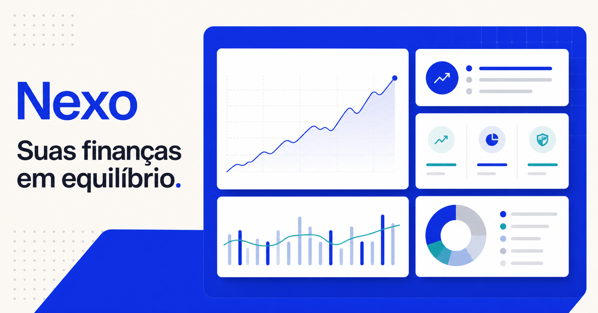

# Nexo — Dashboard Financeiro Pessoal

Uma experiência moderna e responsiva para acompanhar saldo, receitas, despesas, transações e metas financeiras em um só lugar.



## Sobre o projeto

O Nexo foi criado como um projeto de portfólio focado em organização de dados e experiência do usuário. O dashboard transforma informações financeiras em uma visão clara, permitindo identificar rapidamente o fluxo de caixa, a distribuição de gastos e o progresso das metas.

## Funcionalidades

- Resumo de saldo, receitas, despesas e economia mensal
- Gráfico interativo de fluxo de caixa
- Distribuição de despesas por categoria
- Filtros por período e categoria
- Busca de transações em tempo real
- Cadastro de novas receitas e despesas
- Opção para ocultar valores sensíveis
- Acompanhamento de meta financeira
- Navegação adaptada para desktop e dispositivos móveis

## Tecnologias

- React 19
- TypeScript
- Recharts
- Lucide React
- CSS responsivo
- Vinext e Cloudflare Workers

## Demonstração

[Acessar o dashboard publicado](https://ronaelmoura.github.io/nexo-dashboard-financeiro/)

Os dados exibidos são fictícios e foram criados exclusivamente para demonstrar a interface e suas interações.

## Executando localmente

Requer Node.js 22.13 ou superior.

```bash
npm install
npm run dev
```

Depois, acesse `http://localhost:3000`.

Para gerar a versão de produção:

```bash
npm run build
```

## Autor

Desenvolvido por [Ronael Moura](https://github.com/ronaelmoura).
